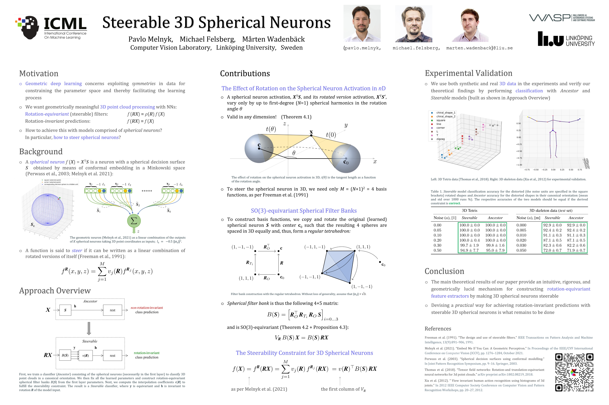

# Steerable 3D Spherical Neurons

The official implementation of the "Steerable 3D Spherical Neurons" paper, Proceedings of the 39th International Conference on Machine Learning, ICML 2022, 17-23 July, 2022

[[arXiv]](https://arxiv.org/abs/2106.13863) [[bibtex]](https://github.com/pavlo-melnyk/steerable-3d-neurons#citation)


## Poster
(best viewed as an image in a new tab)



## Requirements
> 📋We achieved the original results with Python 3.7.10, ```torch==1.8.1```,  ```scipy==1.6.1```, ```numpy==1.20.3```. Other dependencies include ```matplotlib``` and ```tqdm```.

To install the requirements, run:

```
pip install -r requirements.txt
```

## Datasets
The ```utkinect_skeletons_data``` folder contains the 3D skeleton data that we extracted and preprocessed from [UTKinect-Action3D dataset](http://cvrc.ece.utexas.edu/KinectDatasets/HOJ3D.html). The preprocessing and data split are described in Section 5.1 in the paper.

## Demo

The ```demo_[dataset_name].ipynb``` notebooks demonstrate a step-by-step construction of the proposed steerable spherical model, as well as the experiments with the corresponding datasets reported in the paper.

## Citation
```
@InProceedings{pmlr-v162-melnyk22a,
  title = 	 {Steerable 3{D} Spherical Neurons},
  author =       {Melnyk, Pavlo and Felsberg, Michael and Wadenb{\"a}ck, M{\aa}rten},
  booktitle = 	 {Proceedings of the 39th International Conference on Machine Learning},
  pages = 	 {15330--15339},
  year = 	 {2022},
  editor = 	 {Chaudhuri, Kamalika and Jegelka, Stefanie and Song, Le and Szepesvari, Csaba and Niu, Gang and Sabato, Sivan},
  volume = 	 {162},
  series = 	 {Proceedings of Machine Learning Research},
  month = 	 {17--23 Jul},
  publisher =    {PMLR},
  pdf = 	 {https://proceedings.mlr.press/v162/melnyk22a/melnyk22a.pdf},
  url = 	 {https://proceedings.mlr.press/v162/melnyk22a.html}
}
```

