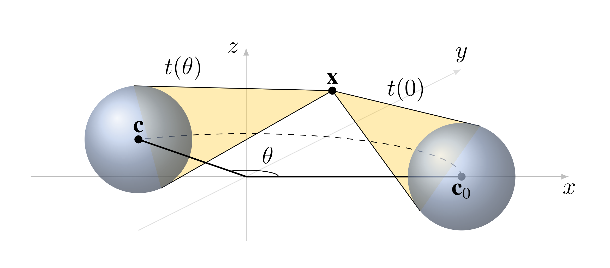
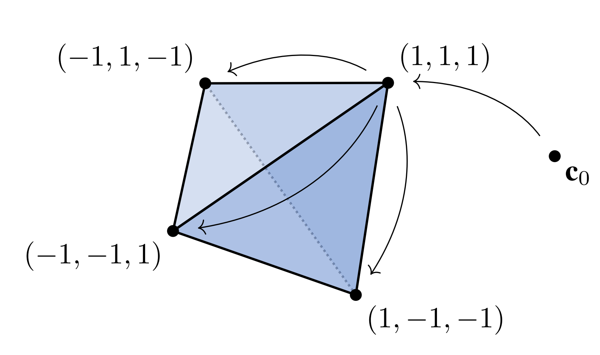

# Steerable 3D Spherical Neurons

The official implementation of the "Steerable 3D Spherical Neurons" paper, Proceedings of the 39th International Conference on Machine Learning, ICML 2022, 17-25 July, 2022

[[arXiv]](https://arxiv.org/abs/2106.13863) [[bibtex]](https://github.com/pavlo-melnyk/steerable-3d-neurons#citation)





## Requirements
> 📋We achieved the original results with Python 3.7.10, ```torch==1.8.1```,  ```scipy==1.6.1```, ```numpy==1.20.3```. Other dependencies include ```matplotlib``` and ```tqdm```.

To install the requirements, run:

```
pip install -r requirements.txt
```

## Datasets
The ```utkinect_skeletons_data``` folder contains the 3D skeleton data that we extracted and preprocessed from [UTKinect-Action3D dataset](http://cvrc.ece.utexas.edu/KinectDatasets/HOJ3D.html). The preprocessing and data split are described in Section 5.1 in the paper.

## Demo

The ```demo_[dataset_name].ipynb``` notebooks demonstrate a step-by-step construction of the proposed steerable spherical model, as well as the experiments with the corresponding datasets reported in the paper.

## Citation

